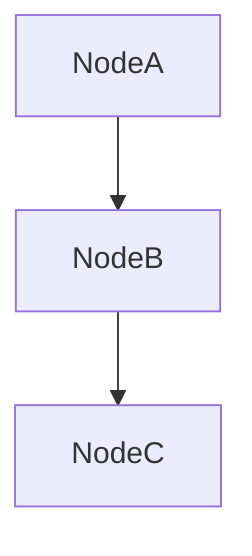
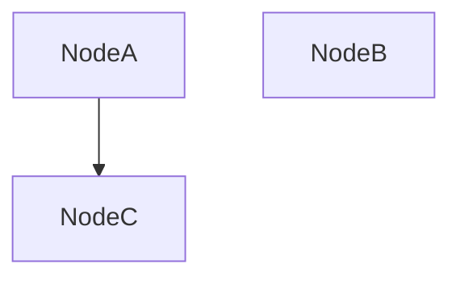

 # Basics of Data Structures and Algorithms

[](https://hackmd.io/MTnpYHwFQvufnsdhsKW_3w)

 
 ## Node
 
- An individual node contains **data** and **links to other nodes**. 
- Nodes are typically link to one or more other nodes. 
- If the node link is `null` that means this node is the end point(**tail node**).



If I want to remove NodeB. The good method is to change the link in NodeA to point to NodeC. And NodeB becomes a **orphaned node**(node without links pointing).



Graph above shows:

1. NodeA = head node
2. NodeC = tail node
3. NodeB = or


### Python Node implementation

```python=class Node:
class Node:
  def __init__(self, value, link_node=None):
    self.value = value
    self.link_node = link_node
    
  def get_value(self):
    return self.value
  
  def get_link_node(self):
    return self.link_node
  
  # Define your set_link_node method below:
  def set_link_node(self, link_node):
    self.link_node = link_node
```

